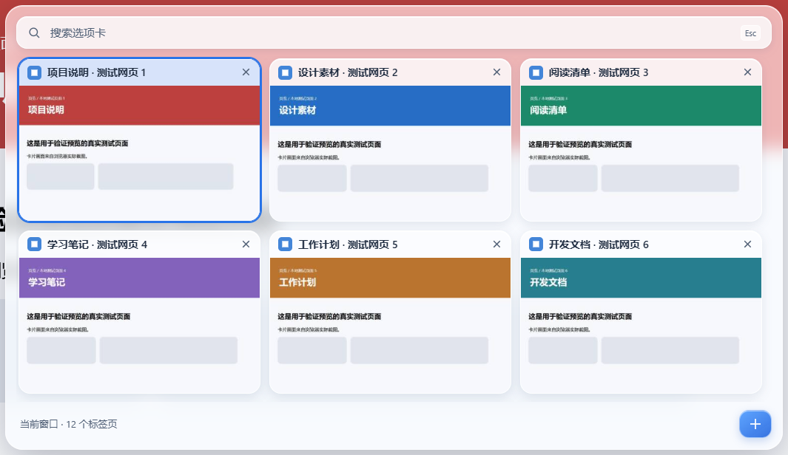
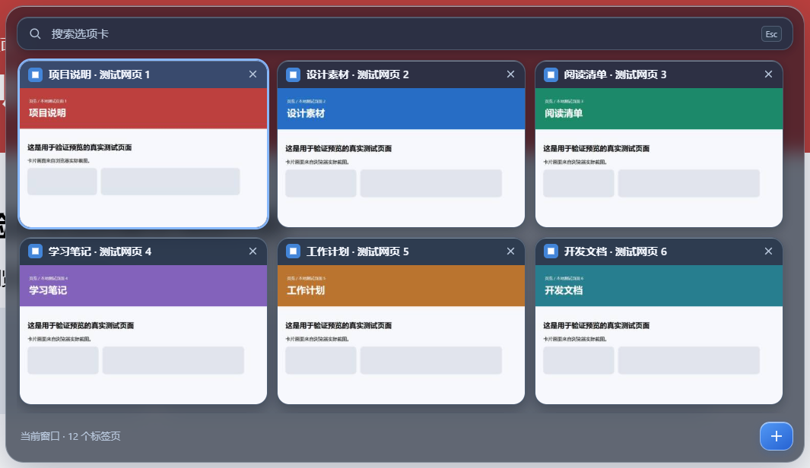
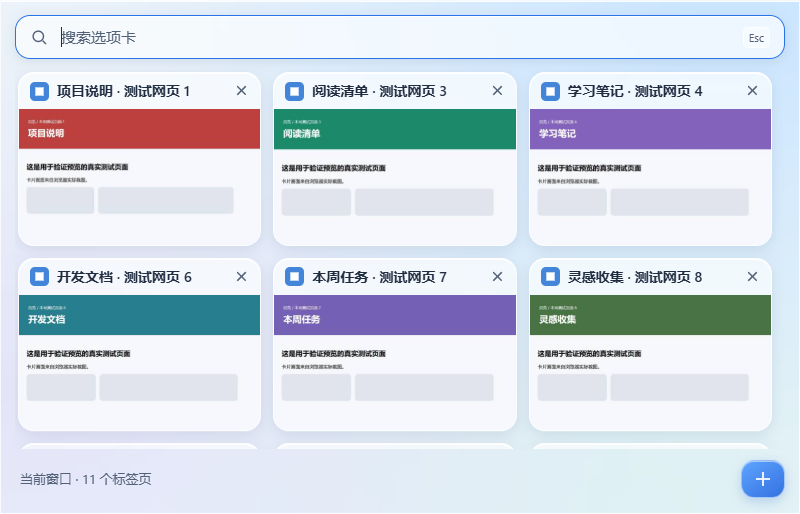

# 页览 · Edge 自用标签页扩展

适用于桌面版 Microsoft Edge 的自用标签页预览扩展，当前版本为 1.2.2。点击工具栏图标，以三列卡片查看当前窗口的标签页，支持搜索、切换、关闭和新建。网页预览仅在本次浏览器会话中临时保留。

请阅读 [中文安装与使用说明](edge-tab-overview/使用说明.md)。

## 插件预览

以下为 v1.2.2 在独立 Edge 测试环境中的真实截图，卡片内容来自本地测试网页。

### 浅色模式

普通网页上的浮层以三列展示标签页，支持网页缩略图、搜索和连续切换。

### 深色模式

### 特殊页面兼容菜单

Edge 内部页等无法注入浮层的页面会使用原生扩展菜单，宽度最多为 800 像素。

## 交付

- `edge-tab-overview/`：可以直接在 Edge 加载的扩展，也是完整源码。
- [下载 v1.2.2 安装包](https://github.com/cjackzh7226/Edge-Tab-Overview-Plugin/releases/tag/v1.2.2)：安装包仅在 GitHub Release 中发布。下载其中的 `edge-tab-overview-v1.2.2.zip`，先解压，再加载其中的 `edge-tab-overview/` 文件夹。
- `tests/results/integration.json`：真实 Edge 自动化验证结果。
- `tests/results/popup-light.png`、`popup-dark.png`：真正叠在网页上的浮层截图，周围能看到实际网页及圆角外的背景。
- `tests/results/popup-fallback.png`：特殊页面使用的原生兼容菜单。
- `tests/results/transparency/feasibility.json`：原生透明限制的独立实验。透明 CSS 的原生弹窗在更换底下网页颜色后画面完全相同；普通网页允许真实浮层，Edge 内部页拒绝注入。

## 验证方式

仓库内保留的验证结果来自 2026-09-14：使用独立测试配置启动 Microsoft Edge 153.0.4234.32，无头模式下加载真实扩展，操作网页浮层和原生兼容菜单。结果记录在 `tests/results/integration.json`，覆盖三列布局、1051 像素浮层及原有卡片尺寸、兼容菜单宽度上限、16:9 预览、内部滚动、切换与恢复、搜索和滚动位置、关闭与新建、窗口隔离、滚动更新、内存清理、重启清空，以及深浅模式的真实透明像素比较、圆角外背景、截图排除浮层和访问令牌检查。

测试通过 `Extensions.triggerAction` 触发真实扩展入口，并监听 `Target.targetCreated` / `Target.targetInfoChanged`，确认首次打开及连续切换不创建 `popup.html` 原生中转弹窗；只有兼容页面才临时打开原生菜单。

普通网页使用真正透出页面的浮层，保持最大 600 像素高度；不保证同时完整显示四排。Edge 内部页、其他扩展页面和不允许注入的页面回退到普通菜单，无法真正透出网页，外框仍受浏览器控制。

没有安装到用户的个人 Edge 配置中。个人配置下的观感、操作系统缩放和弹窗短暂重绘仍应在首次加载后体验确认。

运行测试：`node tests/edge-integration.cjs`。该脚本需要 Playwright 和本机 Edge，可通过 `PLAYWRIGHT_MODULE`、`EDGE_PATH` 指定路径。测试页面由脚本临时在 127.0.0.1 提供，结束后关闭服务。
